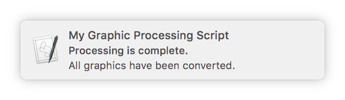
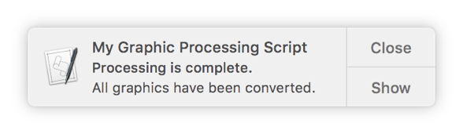

# [DOC](./main.md) / Notifications

Notification Center offers another opportunity for providing feedback during script execution. Use the Standard Additions scripting addition’s `display notification` command to show notifications, such as status updates as files are processed. Notifications are shown as alerts or banners, depending on the user’s settings in *System Preferences > Notifications*.

- **Banner notification**

  

- **Alert notification**

  

To show a notification, provide the display notification command with a string to display. Optionally, provide values for the with title, subtitle, and sound name parameters to provide additional information and an audible alert when the notification appears, as shown in Listing 24-1 and Listing 24-2.

## Guide

Create a valid `AppleScript::Notification` object and run method `#show` for displaying notification.

```ruby
notification = AppleScript::Notification.new(
  title: 'Title',
  description: 'Description'
)

notification.show
```

**Params** `AppleScript::Notification.new`

|         Name |   Type   |      Optional      | Default |                    |
| -----------: | :------: | :----------------: | :-----: | :----------------- |
|       title: | *String* |                    |         | Notification title |
|    subtitle: | *String* | :white_check_mark: |  `nil`  | Notification subtitle |
| description: | *String* |                    |         | Notification description text |
|       sound: | *String* | :white_check_mark: |  `nil`  | Notification sound (`AppleScript::Sounds::{SOUND_NAME}`) or Basso, Blow, Bottle, Frog, Funk, Glass, Hero, Morse,Ping, Pop, Purr, Sosumi, Submarine, Tink. |

## Examples

```ruby
notification = AppleScript::Notification.new(
  title: 'Photo Prep Droplet',
  description: '27 images where processed.',
  sound: AppleScript::Sounds::SUBMARINE
)

notification.show
```


> Clicking the Show button in an alert-style notification opens the app that displayed the notification. For a script app, the action of opening the app again triggers the run handler of the script, potentially causing the script to begin processing a second time. Keep this in mind, and add code to your script to handle this scenario, if appropriate.
